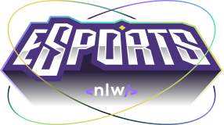

# Find your duo &middot; [](http://makeapullrequest.com)

[English](./README-en.md) 👈

> Desenvolvido na Next Level Week da Rocketseat 🚀

Plataforma onde você pode formar uma dupla para jogar seu jogo favorito juntos.

## Instalação / Execução

### Api

Clone esse repositório utilizando Git e no diretório */server* execute:

```shell
npm install
npm run db:migrate
```

agora, com as migrations executadas e o banco de dados criado, é só rodar o servidor:

```shell
npm run dev
```

que estará online na porta [:3333](http://localhost:3333/).

### Web

No diretório */web* execute:

```shell
npm install
npm run dev
```

a aplicação web estará rodando na porta [:5173](http://localhost:5173/).

## Tecnologias e ferramentas utilizadas

### Front end

A aplicação web foi desenvolvida em **ReactJS** com **Typescript** e criada utilizando o [**Vite**](https://pt.vitejs.dev/guide/why).
A estilização foi feita utilizando o framework CSS **TailwindCSS**, instalado utilizando **PostCSS**, e seguindo o design de um protótipo do app no **Figma**.
Para construir diversos componentes foi utilizada a biblioteca **Radix UI** para ReactJS.

  
  

### Back end

A API foi desenvolvida em **NodeJS** com **Express** e **TypeScript**.
Foi utilizado o ORM **Prisma** com **SQLite** para criação e modelagem do banco de dados, juntamente com a integração da API com o banco de dados.

    